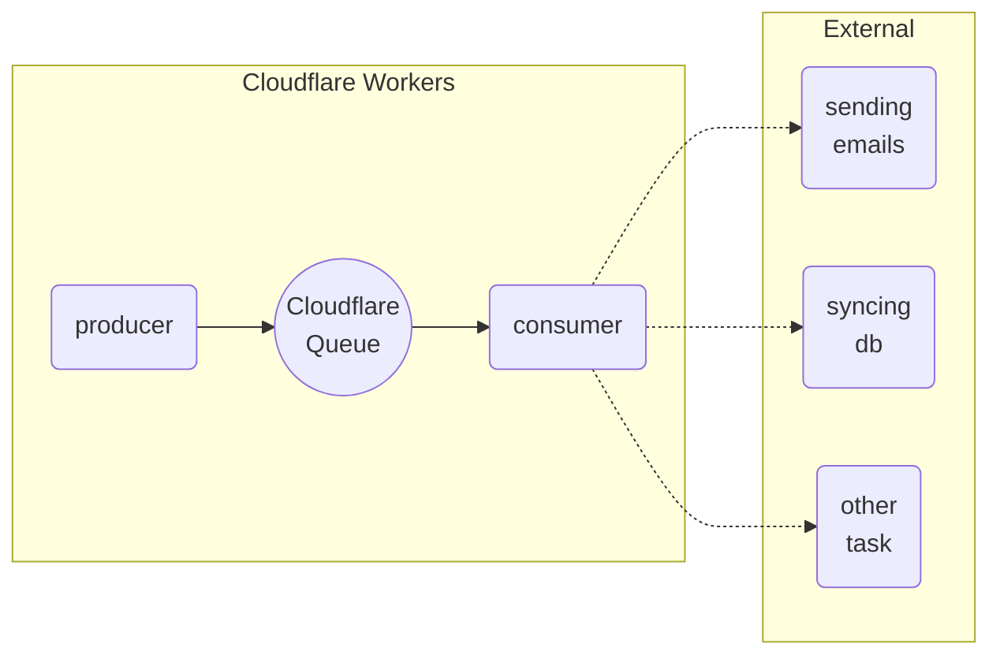

# Queue Worker for Async Tasks

This is a strip down implementation of async queue for long-running tasks, such as sending emails or sync data to R2/databases.

The basic flow is like below.

## Instructions

### Set up secrets

To add or update your Queue Auth Secret to can run the command below, or you can use the Cloudflare Web UI

`pnpm dlx wrangler secret put QUEUE_AUTH_SECRET`

### Deploy worker

to deploy the worker, run the command below.

`pnpm deploy`

If you found the queue not found error you need to create a queue name `my-queue` on your Cloudflare.

